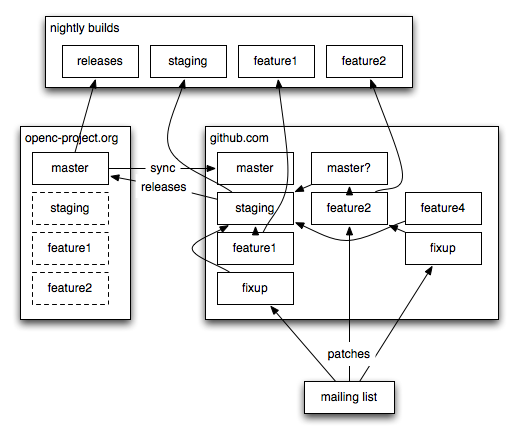

# Development Policy

These small rules for those who [Get Involved](Getting-involved-in-OpenSC-development) in OpenSC help the project produce consistent and predictable output, if followed. It is not a law set in stone but highly recommended.

## The credo of OpenSC

* OpenSC is a gateway to key operations inside smart cards. OpenSC will not generate plaintext key material itself, but it can import plaintext keys to smart cards if requested. OpenSC implements cryptographic operations only for keys that are capable of doing it natively inside the smart card, without exposing the key material to the outside world.

## Wiki

* The language used in the wiki is English. Links to external resources should also directly go to English pages if possible.
* [RFC2119](http://www.ietf.org/rfc/rfc2119.txt) SHOULD be used if possible.
* Please no commercial texts and copywriting, except one-liners like "commercial support for XXX is available from ZZZ" on commercial offers or shop links on card pages. Wiki is not a marketing channel.
* Name things (including wiki pages) with the most appropriate name, preferably the name that appears in the official documentation of the card or product, without the extra ™ © ® symbols. This includes correct capitalization ([Siemens-CardOS-M4](Siemens-CardOS-M4) not cardOS or CardOs).
* Wiki is semi-formal documentation. Try to write in an impersonal but friendly style and stay objective. Don't use "me" or "I" unless writing a personal comment or opinion and always include your name in parentheses if you do. But talk to the reader in a friendly way (using "You"). Avoid using "we" or "our" unless you're sure that you voice the opinion of the majority of project users/developers.
* Less is more. If possible, "do more with less words" so that the reader would not have to read 2 paragraphs to to get a 3 word fact he/she is looking for.
* Don't duplicate wiki content unless necessary and always include a link to the authoritative page.

## Source code

* For inspiration, see [JOINT STRIKE FIGHTER AIR VEHICLE C++ CODING STANDARDS](https://www.stroustrup.com/JSF-AV-rules.pdf)
* Coding Style is mostly the same as the Linux kernel. Have a look at [Documentation/CodingStyle](https://www.kernel.org/doc/html/v4.10/process/coding-style.html) in Linux source. Most important:
  * tabs instead of spaces,
  * space before and after operands,
  * [scripts/Lindent](http://lxr.linux.no/linux/scripts/Lindent) from linux source can be useful for formatting code with indent (`-npro -kr -i8 -ts8 -sob -l80 -ss -ncs`),
  * lines up to around 100..110 characters are OK, wide screens are common,
  * only C89 to allow building with MS Visual Studio [which does not support C99](http://en.wikipedia.org/wiki/C99#Implementations).
* Explicit is better than implicit.
* [maybe](http://marc.info/?l=openbsd-cvs&m=117270339530912) [not](http://lkml.indiana.edu/hypermail/linux/kernel/0206.1/0402.html) `something_t` typedef for every `struct something` and use the `something_t name`
* Machine-generated files are not under version control.
  * `make maintainer-clean` removes all generated files.
* No new dead code (code that is commented out or between always false `#ifdef`-s)
* All new code must be compiled with `--enable-strict` and must not generate warnings.
* Warnings about unused parameters in internal functions must not be silenced `((void))`. Unused parameters in externally defined API-s can be silenced.

### Source code quality

* Unchecked null pointers are bad
* Comments and code shall be in sync
* provide a (description of purpose? man page?) with a command-line program

### Git workflow and versioning

* Git write access is granted to those who [Get Involved](Getting-involved-in-OpenSC-development) with OpenSC development and
  * are card driver authors/maintainers
  * have contributed at least 3 meaningful patches that get integrated
* _"CVS is not a substitute for developer communication"_ applies to Git as well.
* People with write access have the moral responsibility to follow and review the PRs and make the best effort to follow the rest of this small policy.
* OpenSC uses a distributed version control platform and SVN write access rules are basically irrelevant. But disciplined development is important nevertheless.

#### Some helpful tools for working with Git

* [git meld](https://github.com/wmanley/git-meld) command for reviewing with visual diff entire trees.
* Different Git branching strategies
* [A successful Git branching model](http://nvie.com/posts/a-successful-git-branching-model/)
* Git rules (see also [Release Howto](OpenSC-Release-Howto.md))
* Have [topic branches](http://progit.org/book/ch3-4.html). If a meaningful change does not fit into a single commit, have a separate branch.
* Use `git rebase --interactive` to re-write commit messages and re-arrange/squash commits as needed into coherent and granular units.
* Do not mix the branch fed to [Nightly Builds](OpenSC-Services#nightly-builds) machinery with topic branches. Nightly Builds branches (except for master builds) are **supposed** to be rebased or deleted as one sees necessary.
* Have topic branches.

#### Moving master forward

* See also [Release Howto](OpenSC-Release-Howto.md) and [Source Code](Source-Code) wiki pages.
* What does not go to staging:
* Commits that break build
* Commits that generate warnings
* Commits with bad whites paces
* Commits with oneline commit messages.
* Commits that obviously should be bundled with some other change.
* A compiler warning cleanup patch should include the warnings which had been cleaned up in the commit message

### Commit messages

* Commit message is the primary mean to communicate the motivation for a change.
* Tutorial for a nice Git commit message: [A Note About Git Commit Messages](http://tbaggery.com/2008/04/19/a-note-about-git-commit-messages.html)
* If it fixes or addresses a bug, include the ticket number
* If you close the bug afterwards, include the revision number of the commit that fixes the issue.
* Changes for specification conformance should include a reference to the specification ("PKCS#11 v2.20 3.14.59") or quote the important part.
* If the change has a related discussion on opensc-devel, include a link to the thread or most appropriate message in the thread.
* The verbosity of the commit message should be in line with the size of the non-monotonous code changes in a commit.
* String substitution, batch changes, typos, code readability, whitespace fixes, code structure re-organization etc need the actual fix more than the motivation for the commit.
* If it fixes a compiler error or warning, paste the output of the compiler.
* Try not to describe the diff itself (which is obvious to the reader), instead describe the change in behavior of the overall system.
* Overall rule: if you have pointers to further information, include the link to it, while keeping the commit message as informational as possible
* Patch review issues in Linux kernel: [KS2011: Patch review](http://lwn.net/Articles/464298/)

## Mailing list

* Bigger patches should go through a review process on [opensc-devel](Mailing-lists) (or as a Trac ticket, which is propagated to opensc-commits) for at least 3 days (72 hours) to give people time to review it. Developers have real lives as well.
* If the RFC gets no answers, the change is good to go.
* Any motivated comments or questions about a patch need to be acted upon, either with asked modification or motivation for not doing them.
