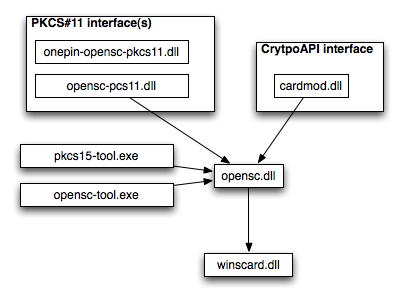

# MS BaseCSP MiniDriver (for Windows XP*, Windows Vista, Windows 7)

 

## Details

Microsoft Windows systems use CryptoAPI in native win32 applications that deal with cryptography. Implementing a full CSP for use in the CryptoAPI ecosystem is a tedious task. BaseCSP implements the heavyweight CSP functionality whereas a card minidriver implements only the necessary calls to support a (usually single) smart card.

The situation is comparable to OpenSC itself, where the OpenSC framework takes care of the annoying parts and to support a new smart card, just a card specific driver needs to be implemented.

The smart card minidriver offers a shortcut compared to building a traditional cryptographic service provider (CSP). It does this by handling most of the complicated cryptographic tasks behind the scenes, saving the developer time and effort.
Available specifications can be found [here](https://learn.microsoft.com/en-us/previous-versions/windows/hardware/design/dn631754(v=vs.85)). The versions are:

* version 5 of the minidriver specification applies to Windows XP (and Windows Vista)
* version 6 applies to Windows Vista
* version 7 applies to Windows 7.

### Resources

Sources available from Microsoft:

* [Specifications](https://learn.microsoft.com/en-us/previous-versions/windows/hardware/design/dn631754(v=vs.85))
* [Smart Card Minidrivers Descriptions](https://learn.microsoft.com/en-us/windows-hardware/drivers/smartcard/smart-card-minidrivers)
* [Smart Card Minidriver Overview](https://learn.microsoft.com/en-us/windows-hardware/drivers/smartcard/smart-card-minidriver-overview)
* [Developer Guidelines](https://learn.microsoft.com/en-us/windows-hardware/drivers/smartcard/developer-guidelines)

## Testing

### Registry information

Supported cards must be listed in `HKLM\SOFTWARE\Microsoft\Cryptograph\Calais\!SmartCards`.
In the following template smart card name ("Example Card") in the key name, ATR and ATRmask must be changed, the rest is standard boilerplate, given that the path to the DLL is correct (no path needed if the file is in system folder, which is the default in WindowsInstaller):

* `HKLM\SOFTWARE\Microsoft\Cryptograph\Calais\!SmartCards\Example Card`
* `HKLM\SOFTWARE\Wow6432Node\Microsoft\Cryptograph\Calais\!SmartCards\Example Card`
  * `"ATR"=hex:XX,XX,XX,XX,XX,XX,XX,XX`
    * `"ATRMask"=hex:ff,ff,ff,ff,ff,ff,ff,ff,ff,ff,ff,ff,ff,ff,ff,ff,ff,ff,ff,ff,ff,ff,ff,ff`
    * `"Crypto Provider"="Microsoft Base Smart Card Crypto Provider"`
    * `"Smart Card Key Storage Provider"="Microsoft Smart Card Key Storage Provider"`
    * `"80000001"="C:\Program Files\OpenSC Project\OpenSC\minidriver\opensc-minidriver.dll"`

### Windows 7

Windows 7 has a renewed device manager and has the capability of downloading smart card drivers automagically from Windows Update. OpenSC contains a [rudimentary .inf file](https://github.com/OpenSC/OpenSC/blob/master/src/minidriver/opensc-minidriver.inf.in) to satisfy the needs of device manager, which identifies devices based on the historical bytes in the ATR of a smart card. For example, the device ID of the [Estonian ID card](https://smartcard-atr.apdu.fr/parse?ATR=3BDE18FFC080B1FE451F034573744549442076657220312E302B) would be `CID_4573744549442076657220312E30`. Changes similar to the registry should be done in the .inf file, before asking Windows to update the unknown smart card device in the device manager with the .inf file.

For testing with Vista and Windows 7 (Windows XP does not contain `certutil.exe`)

```powershell
_certutil.exe -SCinfo_
```

### Caveats

Smart cards with two ATR-s (warm and cold) don't fit into the minidriver discovery design. Additional (signed) filter driver (available for Vista and Windows 7) is needed, which only exposes the cold ATR of the card to userland applications.
