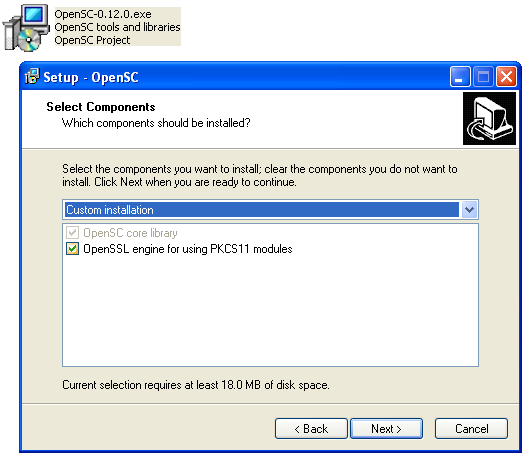

# OpenSC Windows installer

The purpose of the OpenSC installer is to distribute pre-built binary components of OpenSC and sub-projects to the end-user computer, manage simple configuration entries (like required registry keys) and removal of the components.



The contents of the package is:

* OpenSC core (and dependencies)
  * OpenSSL
  * zlib

## Possible installer steps / Windows environment description

* The default installation location is `C:\Program Files\Opensc Project\OpenSC` or equivalent.
  * Only `*.exe`, `*.profile` and `opensc.conf` files are installed to the installation directory. To make applications like Firefox find the `.dll` dependencies, `*.dll` are installed to `C:\Windows\system32` or equivalent.
* Registry keys that OpenSC can use:
  * OpenSC: common key `Software\OpenSC Project\OpenSC` (names are case-preserved, but not case-sensitive)
    * `ConfigFile` - path to OpenSC config, searched from HKCU and HKLM, HKLM set to `C:\Program Files\OpenSC Project\opensc.conf` on install
    * `ProfileDir` - path to OpenSC PKCS#15 initialization profiles, searched from HKCU and HKLM, HKLM set to `C:\Program Files\OpenSC Project\OpenSC\profiles` on install
* pkcs11-spy: common key `Software\OpenSC Project\PKCS11-Spy`
  * `Module` - path to the real PKCS#11 module to load, searched from HKLM, HKCU
  * `Output` - path to the log output file, searched from HKLM, HKCU

## Download

* See the [Home](Home) page for release downloads.
* PreReleases and [Nightly Builds](OpenSC-Services#nightly-builds) are usually available as well.

## Build instructions (Windows)

* Windows x86 or x64 (tested with Windows XP SP3 x86 and Windows 7 SP1 x64).
  * *NB!  All packages should be installed with default settings to default locations for the packaged scripts to work!*
* Windows [Platform SDK](http://www.microsoft.com/downloads/en/details.aspx?FamilyID=35aeda01-421d-4ba5-b44b-543dc8c33a20) (contains Visual Studio 2008 compiler)
  * Windows 8 will remove this option: <http://www.engadget.com/2012/05/24/microsoft-pulling-free-development-tools-for-windows-8-desktop-apps/>
* Installed CNG SDK
* For building the MSI installer: [WiX toolset 3.6.x](http://wix.sourceforge.net/releases/) (3.6.1629.0 used, installing the Wix36.exe from snapshot directory works)
* (optional) For building .exe installer: [Inno Setup](http://www.jrsoftware.org/download.php/is.exe)
* OpenSSL, either built from source or a pre-built binary from [Shining Light Productions](http://www.slproweb.com/products/Win32OpenSSL.html). Build scripts are tuned to the pre-built package.
* [zlib](http://zlib.net/)
  * Unpack to `c:\zlib-1.2.5` and compile from Platform SDK command prompt
    * x86: `SetEnv.cmd /x86 /Release` and `nmake /f win32\Makefile.msc LOC="-DASMV -DASMINF" OBJA="inffas32.obj match686.obj" zlib.lib`
    * x64: `SetEnv.cmd /x64 /Release` and `nmake /f win32\Makefile.msc AS=ml64 LOC="-DASMV -DASMINF -I." OBJA="inffasx64.obj gvmat64.obj inffas8664.obj" zlib.lib`
* If building from SourceCode repository and not from a snapshot targzip:
  * M[inGW/MSYS](http://sourceforge.net/projects/mingw/files/Automated%20MinGW%20Installer/mingw-get-inst/) (install the basic development environment, the last option in the list) for autoconf/automake
  * pkg.m4 from pkg-config to be placed into `c:\mingw\share\aclocal`. If still encountering problems on ./configure time, also put pkg.m4 to `c:\mingw\share\aclocal-1.11`
* Check out the build snippets on [Nightly Builds](OpenSC-Services#nightly-builds)

## Build instructions (Linux)

The following has been done on Ubuntu 16.04, x86_64

* Building the .exe installer requires Mingw32 (`mingw32-runtime` >= 3.15.2) and Wine (for running Inno Setup)

```bash
$ sudo apt-get install binutils-mingw-w64-i686 binutils-mingw-w64-x86-64 docbook-xsl gcc-mingw-w64-i686 gcc-mingw-w64-x86-64 libpcsclite-dev mingw-w64 wine xsltproc gengetopt
```

* You'll need Inno Setup, so fetch and install it (with defaults)

```bash
$ wget http://www.jrsoftware.org/download.php/is.exe
$ wine is.exe
```

* Check out OpenSC:

```bash
$ git clone git@github.com:OpenSC/OpenSC.git
$ cd OpenSC
```

* Build the windows libraries:

```bash
$ export HOST=x86_64-w64-mingw32
$ ./bootstrap 
$ unset CC; unset CXX; ./configure --host=x86_64-w64-mingw32 --disable-openssl --disable-readline --disable-zlib --prefix=${PWD}/win32/opensc
$ make && make install
```

* Build the installer:

```bash
$  wine ~/.wine/drive_c/Program\ Files\ \(x86\)/Inno\ Setup\ 5/ISCC.exe ./win32/OpenSC.iss
# build log removed
Successful compile (2.170 sec). Resulting Setup program filename is:
Z:\home\.....\OpenSC\win32\Output\OpenSC-0.16.0.exe
```

* Use the installer `.exe` from `win32/Output/OpenSC-0.16.0.exe`
* Copy the `dll` files from the win32/bin folder to the location of the installation in windows
